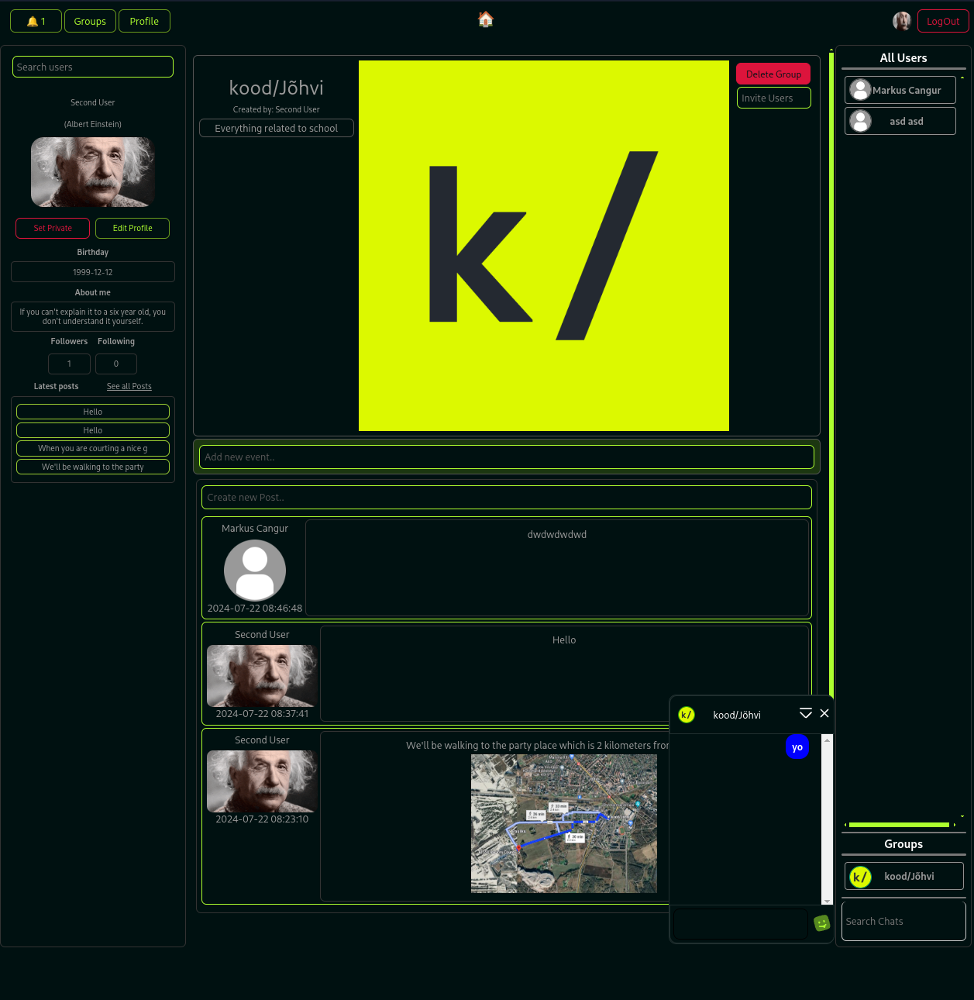

# TERE POISID



Run this command and then go to localhost:3000

```bash
docker compose up
```

http://localhost:3000

[Exercise](https://github.com/01-edu/public/tree/master/subjects/social-network)

[Audit Req](https://github.com/01-edu/public/tree/master/subjects/social-network/audit)
